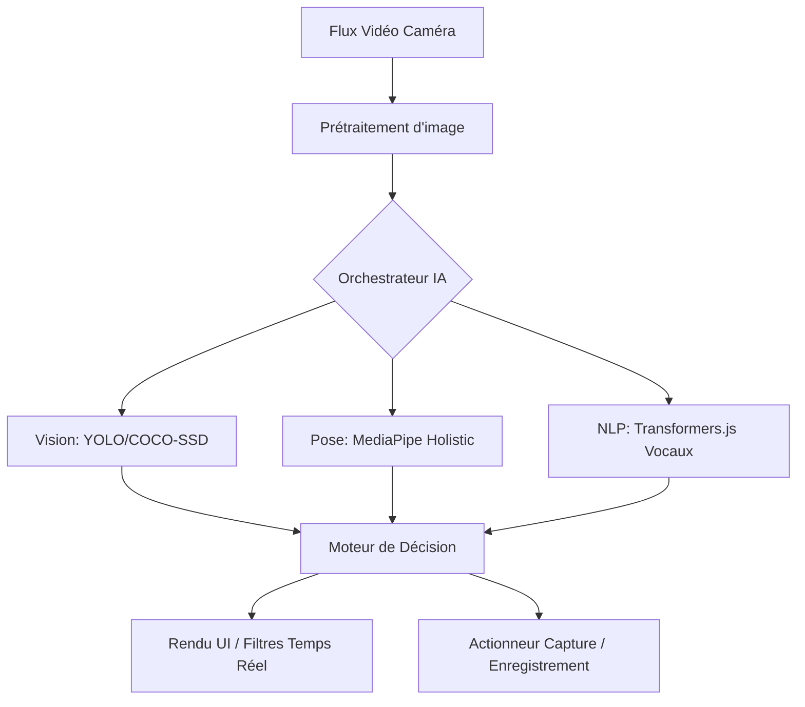

# 📸 Gear360 Magic Camera

> Application photo mobile professionnelle avec intelligence artificielle avancée

[](https://reactjs.org/)
[](https://www.typescriptlang.org/)
[](https://vitejs.dev/)
[](https://capacitorjs.com/)
[](LICENSE)

## 🎥 Démonstration

````carousel

<!-- slide -->

````

## ⚠️ État d’implémentation

| Fonctionnalité | État | Détails |
|:---|:---:|:---|
| Capture photo/vidéo standard | ✅ | Optimisée avec `useCallback` |
| Détection objets (COCO-SSD) | ✅ | Temps réel, 80+ classes |
| Analyse corporelle (MediaPipe) | ✅ | Squelette 3D complet |
| Contrôle vocal (Français) | ✅ | Commandes système intégrées |
| Samsung Gear 360 | 🟡 | Support partiel (connexion/capture) |
| Microsoft Kinect | 🟡 | Prototype (profondeur/squelette) |
| IA générative 3D | 🔵 | Recherche & Développement |
| Conversion 2D → 3D | 🔵 | Concept en cours d'exploration |

## ✨ Fonctionnalités Principales

### 📷 Capture Professionnelle
- **Photos 360°** - Support complet Samsung Gear 360
- **Modes avancés** - Portrait, Nuit, Nourriture, Panorama, RAW
- **Vidéo 4K/60fps** - Enregistrement haute qualité
- **Ralenti extrême** - 960 FPS
- **Rafale intelligente** - Capture multiple rapide

### 🤖 Intelligence Artificielle
- **Détection d'objets** - 80+ catégories (YOLO/COCO-SSD)
- **Reconnaissance faciale** - Détection et suivi en temps réel
- **Analyse corporelle** - 33 points de repère 3D (MediaPipe)
- **Détection de gestes** - 5+ gestes de contrôle (👋👍✌️☝️)
- **Détection de masques** - Reconnaissance automatique
- **IA générative 3D** - Création d'environnements immersifs

### 🎙️ Contrôle Intelligent (Mains-libres)
- **Commandes vocales** - Pilotage intégral en français (Capture, Mode, Zoom)
- **Reconnaissance gestuelle** - Déclenchement par signes (✌️, 👍, 👋)
- **Détection de posture** - Ajustement automatique du cadrage
- **Capture adaptative** - Déclenchement automatique selon l'émotion ou le sujet

## 🧠 Architecture IA

Le pipeline d'intelligence artificielle de l'application fonctionne de manière hybride et locale :



- **Inférence Locale** : Tous les modèles tournent directement sur l'appareil (via WebGL/WebAssembly), garantissant une latence minimale.
- **Modulaires** : Les modèles peuvent être activés/désactivés dynamiquement pour préserver la batterie.

### 🎨 Effets et Filtres
- **Filtres IA** - Transformation en temps réel
- **Remplacement d'arrière-plan** - Changement de décor IA
- **Embellissement visage/corps** - Amélioration automatique
- **Filtres professionnels** - Bibliothèque complète

### 🌐 Connectivité Multi-Appareils
- **Wi-Fi & Bluetooth** - Connexion simultanée
- **Samsung Gear 360** - Support natif
- **Microsoft Kinect** - Détection de profondeur
- **Multi-caméras** - Synchronisation d'appareils

### 🎬 Studio 3D IA
- **Génération à partir de texte** - Créer des scènes 3D
- **Conversion 2D → 3D** - Transformer photos en environnements
- **Rendu temps réel** - Three.js & React Three Fiber
- **Visualisation VR** - Immersion 360°

## 🚀 Installation

### Prérequis
- Node.js 18+ ou Bun
- npm/yarn/bun
- Git

### Installation rapide

```bash
# Cloner le repository
git clone https://github.com/VOTRE_USERNAME/gear360-magic-camera.git
cd gear360-magic-camera

# Installer les dépendances
npm install
# ou
bun install

# Lancer le serveur de développement
npm run dev
# ou
bun dev
```

L'application sera disponible sur `http://localhost:8080`

## 📱 Build pour Production

### Web
```bash
npm run build
```

### Android
```bash
npm run build
npx cap sync android
npx cap open android
```

### iOS
```bash
npm run build
npx cap sync ios
npx cap open ios
```

## 🛠️ Technologies

### Frontend
- ⚛️ **React 18.3** - Framework UI
- 📘 **TypeScript 5.8** - Typage statique
- ⚡ **Vite 5.4** - Build tool ultra-rapide
- 🎨 **Tailwind CSS** - Framework CSS utilitaire
- 🧩 **shadcn/ui** - Composants UI modernes

### 3D & Visualisation
- 🎭 **Three.js** - Rendu 3D
- 🎪 **React Three Fiber** - React pour Three.js
- 🎯 **@react-three/drei** - Helpers 3D

### Intelligence Artificielle
- 🧠 **TensorFlow.js** - Machine learning navigateur
- 👁️ **COCO-SSD** - Détection d'objets
- 🎭 **MediaPipe** - Vision par ordinateur
- 🤖 **Transformers.js** - Modèles Hugging Face

### Mobile
- 📱 **Capacitor 7** - Framework mobile natif
- 🍎 **iOS Support** - Déploiement App Store
- 🤖 **Android Support** - Déploiement Play Store

### Services
- ☁️ **Supabase** - Backend persistante & Auth
- 🔄 **TanStack Query** - Synchronisation état async
- 🚦 **React Router** - Navigation SPA fluide

## 📱 Compatibilité & Performance

### Prérequis Matériels
- **Minimum** : Appareil avec processeur milieu de gamme (ex: Snapdragon 7 series).
- **Recommandé** : Snapdragon 8 Gen 1+ ou Apple A15 Bionic+ pour une inférence IA fluide (> 30 FPS).
- **Stockage** : 100 Mo (plus cache pour les modèles IA).

### Support OS
- **Android** : Testé sur Android 11, 12, 13, 14.
- **iOS** : Support expérimental via Capacitor (limitations liées à WebKit pour l'accès caméra avancé).

### Permissions Requises
- `CAMERA` : Pour la capture et l'analyse IA.
- `MICROPHONE` : Pour les commandes vocales.
- `GALLERY` : Pour la sauvegarde des médias.

## 🔐 Confidentialité & Éthique

Nous plaçons la vie privée au centre du développement :
- 🛡️ **Traitement 100% Local** : Vos photos, visages et voix sont analysés sur votre appareil. Rien n'est envoyé sur nos serveurs sans votre action explicite de partage.
- 🚫 **Données Biométriques** : Aucun profil biométrique persistant n'est créé ou stocké.
- 🇪🇺 **Conformité RGPD** : L'application ne collecte aucune donnée personnelle par défaut.

## 📂 Structure du Projet

```
gear360-magic-camera/
├── 📁 android/                 # Configuration Android Capacitor
├── 📁 public/                  # Assets statiques
├── 📁 src/
│   ├── 📁 components/          # Composants React (110+)
│   │   ├── camera/            # Composants caméra
│   │   ├── connectivity/      # Gestion multi-appareils
│   │   ├── modes/             # Modes de capture
│   │   ├── settings/          # Paramètres
│   │   └── ui/                # Composants UI shadcn
│   ├── 📁 pages/
│   │   ├── Camera.tsx         # Page caméra principale
│   │   ├── Gallery.tsx        # Galerie photos/vidéos
│   │   ├── AI3DStudio.tsx     # Studio 3D IA
│   │   ├── Settings.tsx       # Paramètres
│   │   └── ...
│   ├── 📁 services/
│   │   ├── gear360Service.ts  # Service Gear 360
│   │   ├── kinectService.ts   # Service Kinect
│   │   ├── bluetoothService.ts
│   │   └── multiDeviceManager.ts
│   ├── 📁 hooks/              # Hooks React personnalisés
│   ├── 📁 utils/              # Utilitaires
│   └── App.tsx                # Composant principal
├── 📄 index.html              # Page HTML (100% FR)
├── 📄 package.json            # Dépendances
├── 📄 vite.config.ts          # Config Vite
├── 📄 tsconfig.json           # Config TypeScript
└── 📄 README.md              # Ce fichier
```

## 🎯 Fonctionnalités Détaillées

### Modes de Capture
| Mode | Description |
|------|-------------|
| 📷 **Photo** | Capture haute résolution |
| 🎥 **Vidéo** | 4K 60fps, ralenti |
| 👤 **Portrait** | Flou d'arrière-plan IA |
| ⭐ **Pro** | Contrôles manuels complets |
| 🌙 **Nuit** | Longue exposition |
| 🍔 **Nourriture** | Optimisation culinaire |
| 🔄 **Panorama** | Photos 360° |
| 🎨 **Créatif** | Filtres artistiques |

### Détection IA
- **Objets** : Personnes, animaux, véhicules, nourriture, etc.
- **Visages** : Détection, tracking, reconnaissance d'émotions
- **Corps** : Pose estimation, squelette 3D
- **Mains** : Reconnaissance de gestes
- **Masques** : Détection port du masque

### Commandes Vocales (FR)
- "Capture" / "Photo" - Prendre une photo
- "Vidéo" - Démarrer/arrêter enregistrement
- "Mode portrait" - Changer de mode
- "Zoom avant/arrière" - Contrôle zoom
- "Flash on/off" - Contrôle flash

## 🌍 Internationalisation

L'application est **100% en français** :
- ✅ Interface utilisateur
- ✅ Messages système
- ✅ Métadonnées HTML
- ✅ Documentation

## 🤝 Contribution

Les contributions sont les bienvenues ! 

1. Fork le projet
2. Créez une branche (`git checkout -b feature/AmazingFeature`)
3. Committez vos changements (`git commit -m '✨ Add AmazingFeature'`)
4. Push vers la branche (`git push origin feature/AmazingFeature`)
5. Ouvrez une Pull Request

### Changelog

### v0.0.2 - 2025.12.23 - Mise à jour Produit & Documentation
- ✨ **Product Vision** : Refonte complète du README pour une présentation professionnelle.
- 📊 **Status Map** : Ajout du tableau d'état d'implémentation des fonctionnalités.
- 🧠 **AI Architecture** : Documentation du pipeline de vision et de traitement vocal.
- 📱 **Specs** : Ajout des recommandations matérielles et de compatibilité OS.
- 🔐 **Privacy** : Section dédiée à la confidentialité et au traitement local des données.

### v0.0.1 - 2025.12.23 - Maintenance & Types
- 🔄 **Maintenance** : Mise à jour des dépendances NPM et Browserslist.
- 🛠️ **Refactor** : Correction massive des erreurs de lint et amélioration de la sécurité des types (Camera, Gallery, Services).
- 🏗️ **Fix** : Correction des fuites mémoire potentielles dans les flux caméra.

### v0.0.0 - 2025.12.22 - Release Initial
- ✨ Application caméra 360° complète
- 🤖 Intégration IA avancée (YOLO, MediaPipe, TensorFlow)
- 🎙️ Contrôle vocal en français
- 🤲 Reconnaissance gestuelle
- 🌐 Multi-appareils (Gear 360, Kinect)

## 📄 License

Ce projet est sous licence MIT - voir le fichier [LICENSE](LICENSE) pour plus de détails.

## 👨‍💻 Auteur

Développé avec ❤️ pour la communauté

## 🙏 Remerciements

- [React](https://reactjs.org/)
- [TensorFlow.js](https://www.tensorflow.org/js)
- [MediaPipe](https://mediapipe.dev/)
- [Three.js](https://threejs.org/)
- [shadcn/ui](https://ui.shadcn.com/)
- [Capacitor](https://capacitorjs.com/)

## 📞 Support

Pour toute question ou problème :
- 🐛 Ouvrez une [issue](https://github.com/VOTRE_USERNAME/gear360-magic-camera/issues)
- 💬 Discussions dans les [GitHub Discussions](https://github.com/VOTRE_USERNAME/gear360-magic-camera/discussions)

---

⭐ Si ce projet vous plaît, n'hésitez pas à mettre une étoile !
